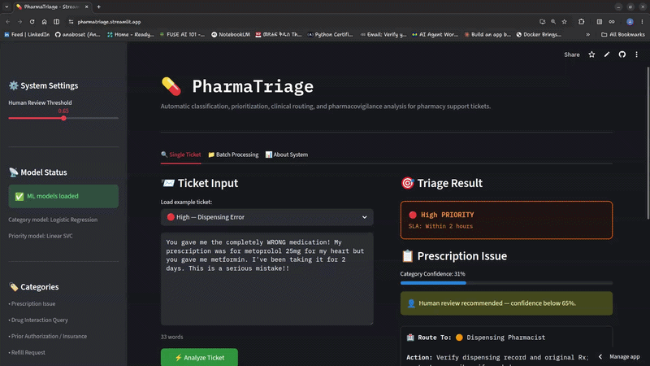

# 💊 PharmaTriage

> **Automatic classification, clinical prioritization, and department routing of pharmacy support tickets — built by a pharmacy professional using NLP and machine learning.**

[](https://www.python.org/)
[](https://scikit-learn.org/)
[](https://streamlit.io/)
[](LICENSE)

---

## 🔗 [Live](https://pharmatriage.streamlit.app/)

**[▶ Try it on Streamlit](https://pharmatriage.streamlit.app/)**

---




---
## Overview

Pharmacy support teams receive large volumes of unstructured patient tickets ranging from billing questions to urgent medication safety concerns. Manual triage slows response times and increases the risk of missing clinically urgent cases.

PharmaTriage automates this workflow by combining:

- Clinical NLP preprocessing
- Machine learning classification
- Rule-based patient safety escalation logic

The system classifies tickets, predicts urgency, routes cases to the correct pharmacy team, and flags potential adverse drug reactions for pharmacovigilance review.

---

## ✨ Features
- 🧠 Multi-class pharmacy ticket classification
- 🚨 Priority prediction (CRITICAL / High / Medium / Low)
- 🏥 Department routing recommendations
- ⚠️ Rule-based safety escalation overrides
- 🔬 ADR (Adverse Drug Reaction) signal detection
- 🔒 PHI-aware preprocessing pipeline
- 📊 Streamlit dashboard for interactive triage

---


## 🏗 Architecture

```
Raw Ticket
   ↓
Clinical NLP Preprocessing
   ↓
TF-IDF Vectorization
   ↓
Category + Priority Models
   ↓
Safety Rule Engine
   ↓
Triage Output + Routing
```

---


## 📊 Model Performance

| Task                    | Selected Model      | Test F1 | Notes                                             |
| ----------------------- | ------------------- | ------- | ------------------------------------------------- |
| Category Classification | Logistic Regression | 0.996   | Strong interpretability and stable CV performance |
| Priority Classification | Linear SVC          | 1.000   | Best handling of severe class imbalance           |

> ⚠️ Models were trained on synthetic pharmacy support ticket data. Real-world language generalization is lower (~75%), which is why deterministic safety rules are included as an additional safeguard.

---

## 🚨 Clinical Safety Design

PharmaTriage uses a hybrid ML + rules architecture.

Machine learning handles nuanced ticket classification, while deterministic safety rules guarantee escalation for life-threatening situations such as:

- Overdose
- Anaphylaxis
- Suicidal ideation
- Severe adverse drug reactions

This mirrors real clinical decision support system design where safety-critical workflows should not rely solely on probabilistic models.


---

## 🧪 Clinical Categories

| Category | Clinical Significance | Default Priority |
|---|---|---|
| Drug Interaction Query | Contraindication or DDI risk | High |
| Side Effect / Adverse Drug Reaction | Potential pharmacovigilance event | High |
| Prescription Issue | Dispensing error, wrong dose/drug | High |
| Controlled Substance | DEA compliance, PDMP verification | High |
| Prior Authorization / Insurance | PA denial, formulary issue | Medium |
| Refill Request | Medication adherence continuity | Medium |
| Medication Counseling | Patient education | Low |
| Billing & Copay | Financial/administrative | Low |
| General Inquiry | General pharmacy questions | Low |

---

## 🚨 Priority Tiers & SLA

| Tier | Response SLA | Example Triggers |
|---|---|---|
| 🔴 **CRITICAL** | Immediate — call emergency / on-call pharmacist | Overdose, anaphylaxis, difficulty breathing, suicidal ideation |
| 🟠 **High** | Within 2 hours | Drug interaction, dispensing error, severe ADR, last dose of critical med |
| 🟡 **Medium** | Within 24 hours | PA denial, refill running low, prescription expired |
| 🟢 **Low** | Within 48–72 hours | Billing question, general inquiry, storage question |

---

## 🗂 Project Structure

```
FUTURE_ML_02/
│
├── src/
│   ├── taxonomy.py          # Clinical brain: categories, priority signals, routing
│   ├── preprocess.py        # PHI redaction, abbreviation expansion, cleaning pipeline
│   ├── data_generator.py    # Synthetic domain-expert ticket generation
│   ├── train.py             # Multi-model training + comparison pipeline
│   ├── evaluate.py          # Metrics, confusion matrices, model comparison charts
│   └── predict.py           # Inference API (TriageResult dataclass)
│
├── helpers/
│   ├── categories.py
│   ├── keywords.py
│   ├── patterns.py
│   └── routing.py
│
├── data/
│   ├── raw/                 # Original data 
│   ├── processed/           # Cleaned, feature-engineered data
│   └── templates/
│       ├── fillers.yaml
│       └── templates.yaml
│
├── models/                  # Saved model artifacts (.pkl)
├── reports/figures/         # Charts: confusion matrices, model comparison
├── app.py                   # Streamlit demo application
└── requirements.txt
```

---

## 🚀 Getting Started

### Clone the Repository
```bash
git clone https://github.com/anaboset/FUTURE_ML_02
cd FUTURE_ML_02
```
### Install Dependencies
```bash
pip install -r requirements.txt
```
### Generate Synthetic Data
```bash
python -m src.data_generator
```

### Train Models
```bash
python -m src.train
```

### Lauch Streamlit App
```bash
streamlit run app.py
```

---
## 📌 Example Ticket
```
Patient reports facial swelling and difficulty breathing after taking amoxicillin.
```
---
## ⚠️ Limitations
- Models are trained primarily on synthetic pharmacy support ticket data
- Real-world patient language is more variable than templated training examples
Current system is English-only
- This project is intended for educational and portfolio purposes, not clinical deployment

---
*Built by AI/ML trainee & Pharmacy Student*